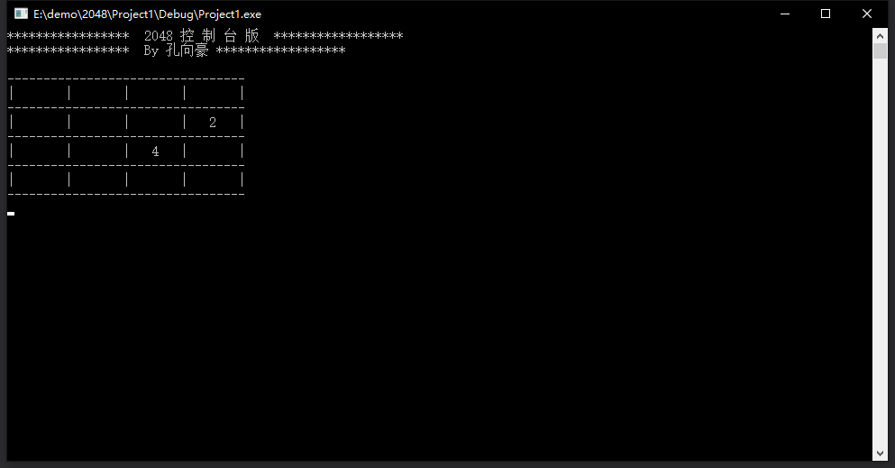

# 控制台版2048小游戏使用手册

## 概述
《2048》是一款比较流行的数字游戏，原作者是Gabriele Cirulli，这款游戏是基于《1024》和《小3传奇》的玩法开发而成的新型数字游戏。我以自己对游戏的理解利用C++编写了这个简单的小游戏。  
一般的玩家也能够玩转这款游戏，感兴趣的话就去体验一番！

## 测试方法
采用黑盒测试的方法，检查程序功能是否按照游戏规则与方法正常使用，程序是否能适当地接收和正确的输出。

## 操作指南 
游戏规则很简单，每次可以选择上下左右其中一个方向去滑动，每滑动一次，所有的数字方块都会往滑动的方向靠拢外，系统也会在空白的地方乱数出现一个数字方块，相同数字的方块在靠拢、相撞时会相加。系统给予的数字方块不是2就是4，玩家要想办法在这小小的16格范围中凑出“2048”这个数字方块。  
游戏的画面很简单，一个整体16个方格，整体格调很是简单。  
在玩法规则也非常的简单，一开始方格内会出现2或者4等这两个小数字，玩家只需要上下左右其中一个方向来移动出现的数字，所有的数字就会想滑动的方向靠拢，而滑出的空白方块就会随机出现一个数字，相同的数字相撞时会叠加靠拢，然后一直这样，不断的叠加最终拼凑出2048这个数字就算成功。  
游戏界面如下：

## 贡献者
华中科技大学 计算机学院研究生17级 方舟

## 版本更新日志
无。

## 作者
华中科技大学 电气与电子工程学院本科生16级 孔向豪

## 致谢
感谢方舟在本产品开发过程中给出的意见和对若干BUG修复所提供的帮助，特此鸣谢。