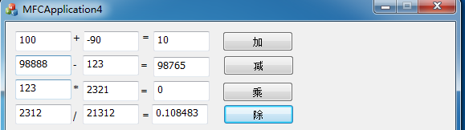

# 程序简介
这是一个计算器程序，采用C++语言在VS 2017平台上编写而成，能实现基本的四则运算并具有较好的人机交互界面。
# 程序框架
## 构成要素
程序是基于MFC图形界面编写而成的，基本构成要素是编辑框、按键与文本。
## 程序流程
* 初始化
* 进入循环
* 编辑框填写
* 数据更新
* 按键检测
* 计算
## 部分代码
### 按键
```
void CMFCApplication4Dlg::OnBnClickedButton1()
{
	UpdateData(true);
	result = suma + sumb;
	UpdateData(false);
}
```
### 对话框
```
BOOL CMFCApplication4Dlg::OnInitDialog()
{
	CDialogEx::OnInitDialog();
	ASSERT((IDM_ABOUTBOX & 0xFFF0) == IDM_ABOUTBOX);
	ASSERT(IDM_ABOUTBOX < 0xF000);
    CMenu* pSysMenu = GetSystemMenu(FALSE);
	if (pSysMenu != nullptr)
	{
		BOOL bNameValid;
		CString strAboutMenu;
		bNameValid = strAboutMenu.LoadString(IDS_ABOUTBOX);
		ASSERT(bNameValid);
		if (!strAboutMenu.IsEmpty())
		{
			pSysMenu->AppendMenu(MF_SEPARATOR);
			pSysMenu->AppendMenu(MF_STRING, IDM_ABOUTBOX, strAboutMenu);
		}
	}
	SetIcon(m_hIcon, TRUE);			
	SetIcon(m_hIcon, FALSE);		
	return TRUE; 
}
```
# 程序效果

# 参考链接
[Blog](https://blog.csdn.net/hippig/article/details/8617596)
